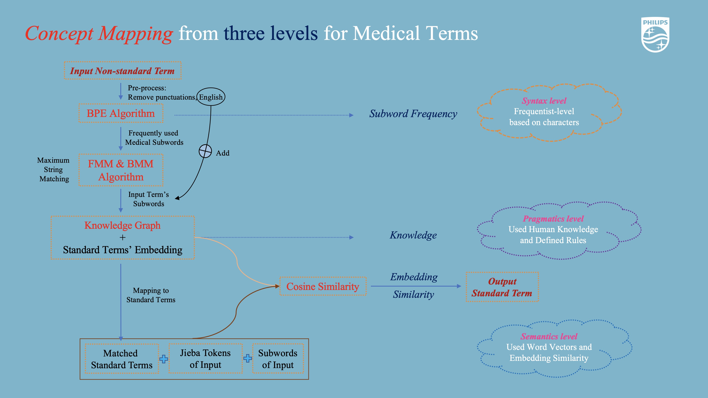
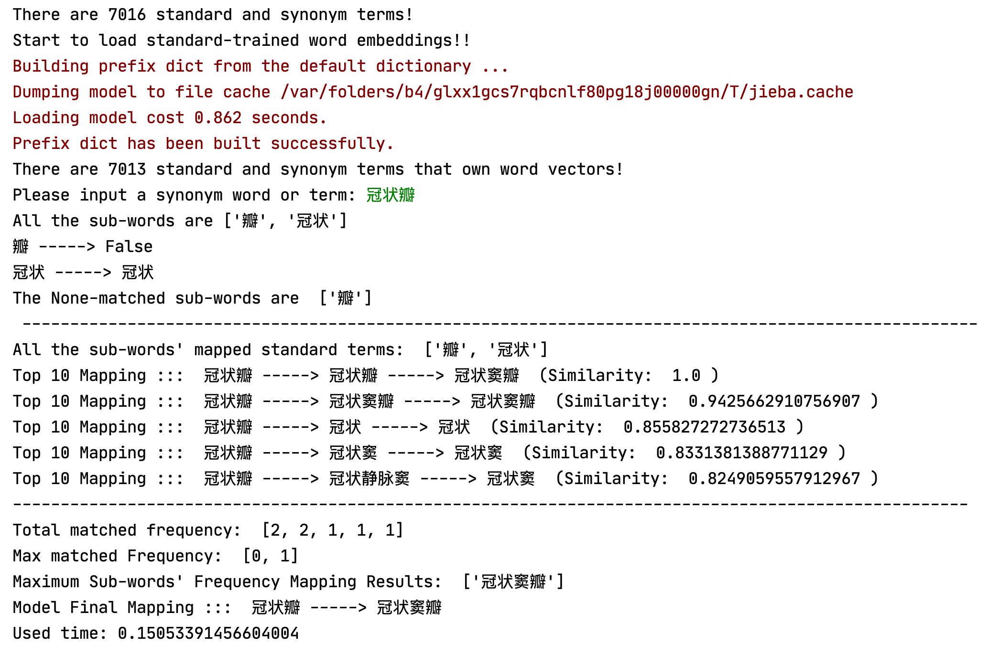
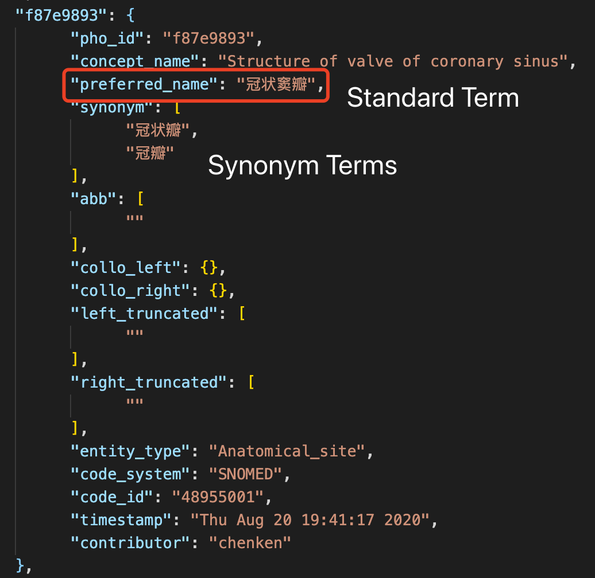

# Medical-Concept-Mapping

An implementation of **Medical-term Concept Mapping** via three-levels: **Syntax**-**Semantics**-**Pragmatics**.

## Method

Overall Method is shown below:

<p align="center">
  
</p>

Specific Method:

1. **Syntax-level**: Sub-word Frequency via BPE Algorithm 

2. **Semantics-level**: Word vector Cosine Similarity
    
    <p align="center">
      
    </p>

3. **Pragmatics-level**: Knowledge Graph

    <p align="center">
      
    </p>

## Usage Demo

1. Get Sub-word (Frequency) list

```text
$ STEP-1-get-subword.py
```

2. Get Standard and Synonym Medical Terms

```text
$ STEP-2-get-Knowledge-Graph.py
```

3. Run the Concept Mapping main Function

```text
$ main.py
```

4. To evaluate, run the Evaluation Function

```text
$ evaluate.py
```

## Results

**96.81% Accuracy** on the Standard and Synonym Medical Terms

## Prerequisites

The pre-trained word vectors can be downloaded [here](https://drive.google.com/file/d/1b_D5OQHm1XFlHKcMaWUJ8ABiQNPM0meS/view?usp=sharing).

***I'm afraid the data making the sub-word list is unavailable as a result of Philips Intellectual Property and Privacy.***

## Presentation

A presentation of this work can be downloaded [here](https://github.com/SuperBruceJia/paper-reading/raw/master/NLP-field/Sub-words/Concept-Matching-Task.pptx).

## Acknowledgement

This work was done when I was in **Philips Research Shanghai**.
